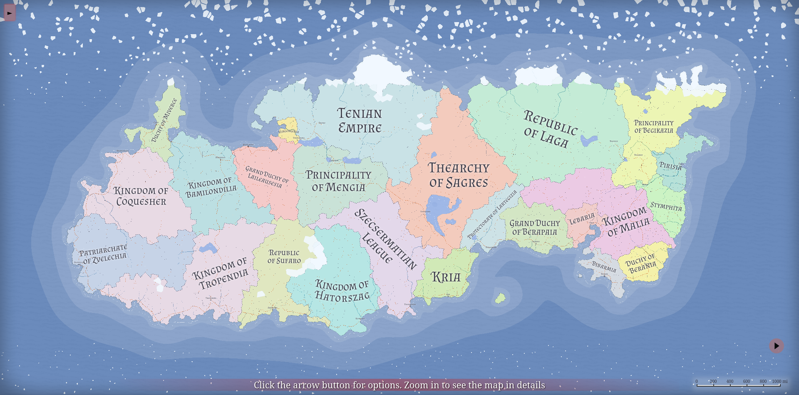
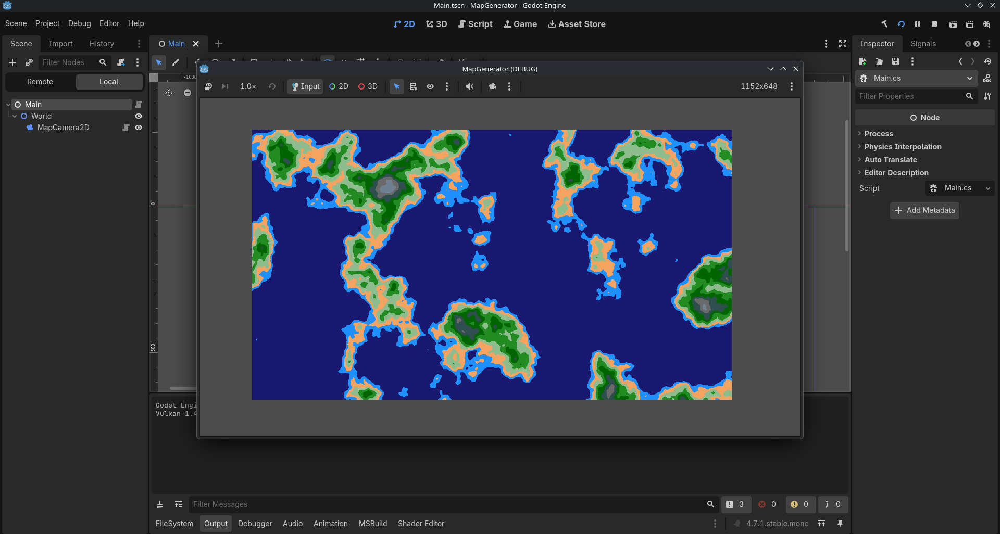
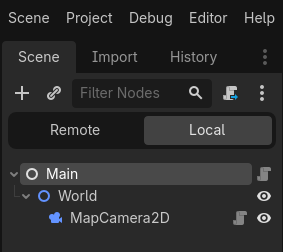

## Rationale

I was inspired by [azgaar/Fantasy-Map-Generator](https://azgaar.github.io/Fantasy-Map-Generator/) and wanted to create something similar in c# that I could use for procedural generation in my own Godot projects.


_Photo from azgaar/Fantasy-Map-Generator_

I started by translating sections of the repository from javascript to c#. Fantasy map generator is more than five years old with 80 contributors which is difficult to maintain without creating a messy codebase. While I don't mind programming with javascript, the codebase uses javascript practices that I strongly dislike. The codebases uses global variables instead of imports which makes it really difficult to track the source of variables for debugging and leads to poor code readibility.

```javascript {13}
// no 'import generateGrid from GraphUtils.js'
...
async function generate(options) {
  try {
    const timeStart = performance.now();
    const { seed: precreatedSeed, graph: precreatedGraph } = options || {};

    invokeActiveZooming();
    setSeed(precreatedSeed);
    INFO && console.group("Generated Map " + seed);

    applyGraphSize();
    randomizeOptions();

    if (shouldRegenerateGrid(grid, precreatedSeed)) grid = precreatedGraph || generateGrid();
    else delete grid.cells.h;
    grid.cells.h = await HeightmapGenerator.generate(grid);
    pack = {}; // reset pack

    Features.markupGrid();
    addLakesInDeepDepressions();
    openNearSeaLakes();
...
```

_'generateGrid() used by main.js' sits in graphUtils.js from fantasy map generator_

<Callout type="tip" title="For Example">
  where main.js and graphUtils.js are files in fantasy map generator, graphUtils.js is a
  globalImport and not imported by main.js which makes navigating the codebase annoying, have to
  perform a global search for the function every time.
</Callout>

Even though I've replicated the voronoi cell generation functionality of the fantasy map generator in c#, which I will discuess in a separate post. By translating the code, I learned alot about how Fantasy Map Generator works and decided to adopt some of its features into a much simpler 2d pixel grid world generator.

## Methodology

The world generator was abstracted into 3 functional layers. The data layer is for storing world information in a constructible class like a vector, the generator layer is for modifying the world data class and the render layer is for visualising the data.

```c# title='Main.cs'
public override void _Ready()
{
    // data layer
    var grid = new Grid(new Vector2I(1152, 648));

    // generator layer
    GenerateHeightMap(grid);

    // render layer
    var renderer = new GridMapRenderer(grid);
    AddChild(renderer);
}
```

### The Data Layer

The data layer is about representing the world with an array-like data structure. When constructed, the world should be blank and empty like a plain canvas because we have not put any data into it yet.

```c#
// example
int[,] world = new int[16, 16]; // simplest way to represent the world using a 2d array
```

In my implementation, I've represented the world using a class called Grid, which is a collection of pixel cells. Instead of a 2d array of intergers.

Each grid collection acts as a 2d array, but I implemented it as a class because I think it would be easiest to use in the future, I do not want to create and use a utility module that edits 2d arrays for world modification.

```c# title='Main.cs'
public class Grid(Vector2I size) : IEnumerable<Cell>
{
	public readonly Vector2I Size = size;

	private readonly Cell[] _cells = InitializeCells(size);

	public Cell this[int x, int y] { // information is stored as a flattened array, In theory this is faster but may not be required and I have not measured performance impacts
		get => _cells[x + y * Size.X];
		set => _cells[x + y * Size.X] = value;
	}

	private static Cell[] InitializeCells(Vector2I size)
	{
		var cells = new Cell[size.X * size.Y];

		for (var i = 0; i < cells.Length; i++)
		{
			var x = i % size.X;
			var y = i / size.X;

			cells[i] = new Cell // initialise with empty values
			{
				Position = new Vector2I(x, y)
			};
		}

		return cells;
	}

	public IEnumerator<Cell> GetEnumerator() => ((IEnumerable<Cell>)_cells).GetEnumerator();
	IEnumerator IEnumerable.GetEnumerator() => GetEnumerator();
}
```

Each pixel cell will be edited in the generator layer and read in the render layer. I could stick with intergers instead of creating a cell class becuase I only generate a height map, but I will eventually want to generate other values for biome creation.

```c# title='Main.cs'
public class Cell(int height = 0, int temperature = 0, int moisture = 0, Vector2I position = default)
{
	public float Height { get; set; } = height;
	public int Temperature { get; set; } = temperature;
	public int Moisture { get; set; } = moisture;
	public Vector2I Position { get; set; } = position;
}
```

An alternative implementation could be an array of hexagons, fantasy map generator features an array of voronoi cells. If you play Minecraft, the minecraft world is a 2d array of chunks, and each chunk is a 3d array of blocks.

### The Generator Layer

This layer is concerned with populating the empty world with data

In my implementation I only use a heightmap. You may populate cells with biome information using height data after first generating the height map.
The world/grid data object is passed into generator methods. The heightmap is created by selecting points on a perlin noise map that are in the same position as pixel cells.

```c#
private static void GenerateHeightMap(Grid grid)
{
    FastNoiseLite heightNoise = new();
    heightNoise.Seed = (int)GD.Randi();
    heightNoise.NoiseType = FastNoiseLite.NoiseTypeEnum.Perlin;
    heightNoise.Frequency = 0.005f;

    foreach (var cell in grid)
        cell.Height = heightNoise.GetNoise2Dv(cell.Position); // R: [-1.0, 1.0]
}
```

### The Render Layer

The render layer reads the world/grid data and visualises it.

In my implementation the renderer reads the height and position of each cell and draws a 1x1 pixel in its position. The height ranges are mapped to colors.

```c#
using Godot;

namespace MapGenerator;

[GlobalClass]
public partial class GridMapRenderer(Grid grid) : Node2D
{
	public Grid Grid { get; set; } = grid;
	public Vector2 Size { get; set; } = new(1, 1);

	public override void _Draw()
	{
		if (Grid is null) return;
		foreach (var cell in Grid)
			DrawRect(new Rect2(cell.Position * 1, Size), WeightsAndBiomes(cell.Height));
	}

	private static Color WeightsAndBiomes(float height)
	{
		var col = height switch
		{
			< 0.1f => Colors.MidnightBlue,
			< 0.15f => Colors.DodgerBlue,
			< 0.2f => Colors.SandyBrown,
			< 0.25f => Colors.DarkSeaGreen,
			< 0.3f => Colors.ForestGreen,
			< 0.35f => Colors.DarkGreen,
			< 0.4f => Colors.DarkSlateGray,
			< 0.45f => Colors.DimGray,
			< 0.6f => Colors.SlateGray,
			_ => Colors.White
		};

		return col;
	}
}
```

## Results



There are alot of ways to extend this which I aim to explore in the future. I want to have biomes, I want this to be in 3d. Something nice for debugging could even be to regenerate the world using a new random seed after pressing space.

I've included the complete implementation below if you want to implement this and get stuck.

Thanks for reading.

## Full implementation

[See GitHub Project](https://github.com/Cool-Bu1lder/godot-simple-map-generator)

### Scene Hierarchy



### Code

<Tabs tabs={['Main.cs', 'GridMapRender.cs', 'MapCamera2D.cs']}>
  <div>

```c#
using System.Collections;
using System.Collections.Generic;
using Godot;

namespace MapGenerator;

public class Cell(int height = 0, int temperature = 0, int moisture = 0, Vector2I position = default)
{
	public float Height { get; set; } = height;
	public int Temperature { get; set; } = temperature;
	public int Moisture { get; set; } = moisture;
	public Vector2I Position { get; set; } = position;
}

public class Grid(Vector2I size) : IEnumerable<Cell>
{
	public readonly Vector2I Size = size;

	private readonly Cell[] _cells = InitializeCells(size);

	public Cell this[int x, int y] {
		get => _cells[x + y * Size.X];
		set => _cells[x + y * Size.X] = value;
	}

	private static Cell[] InitializeCells(Vector2I size)
	{
		var cells = new Cell[size.X * size.Y];

		for (var i = 0; i < cells.Length; i++)
		{
			var x = i % size.X;
			var y = i / size.X;

			cells[i] = new Cell
			{
				Position = new Vector2I(x, y)
			};
		}

		return cells;
	}

	public IEnumerator<Cell> GetEnumerator() => ((IEnumerable<Cell>)_cells).GetEnumerator();
	IEnumerator IEnumerable.GetEnumerator() => GetEnumerator();
}

[GlobalClass]
public partial class Main : Node
{
	public override void _Ready()
	{
		// generate grid
		var grid = new Grid(new Vector2I(1152, 648));

		// generate heightmap
		GenerateHeightMap(grid);

		// draw
		var renderer = new GridMapRenderer(grid);
		AddChild(renderer);
	}

	private static void GenerateHeightMap(Grid grid)
	{
		FastNoiseLite heightNoise = new();
		heightNoise.Seed = (int)GD.Randi();
		heightNoise.NoiseType = FastNoiseLite.NoiseTypeEnum.Perlin;
		heightNoise.Frequency = 0.005f;

		foreach (var cell in grid)
			cell.Height = heightNoise.GetNoise2Dv(cell.Position); // R: [-1.0, 1.0]
	}
}
```

  </div>
  <div>

```c#
using Godot;

namespace MapGenerator;

[GlobalClass]
public partial class GridMapRenderer(Grid grid) : Node2D
{
	public Grid Grid { get; set; } = grid;
	public Vector2 Size { get; set; } = new(1, 1);

	public override void _Draw()
	{
		if (Grid is null) return;
		foreach (var cell in Grid)
			DrawRect(new Rect2(cell.Position * 1, Size), WeightsAndBiomes(cell.Height));
	}

	private static Color WeightsAndBiomes(float height)
	{
		var col = height switch
		{
			< 0.1f => Colors.MidnightBlue,
			< 0.15f => Colors.DodgerBlue,
			< 0.2f => Colors.SandyBrown,
			< 0.25f => Colors.DarkSeaGreen,
			< 0.3f => Colors.ForestGreen,
			< 0.35f => Colors.DarkGreen,
			< 0.4f => Colors.DarkSlateGray,
			< 0.45f => Colors.DimGray,
			< 0.6f => Colors.SlateGray,
			_ => Colors.White
		};

		return col;
	}
}
```

  </div>
  <div>

```c#
// I didn't discuss this in this article, but this script allows you to move around the camera

using Godot;

namespace MapGenerator;

[GlobalClass]
public partial class MapCamera2D : Camera2D
{
    [ExportGroup("Zoom Settings")]
    [Export] private float minZoom = 0.5f;
    [Export] private float maxZoom = 3.0f;
    [Export] private float zoomSpeed = 0.1f;

    [ExportGroup("Pan Settings")]
    [Export] private MouseButton panButton = MouseButton.Left;

    private bool isDragging;

    public override void _UnhandledInput(InputEvent @event)
    {
        if (@event is InputEventMouseButton mouseButtonEvent)
        {
            if (mouseButtonEvent.ButtonIndex == MouseButton.WheelUp && mouseButtonEvent.Pressed)
                ApplyZoom(zoomSpeed);
            else if (mouseButtonEvent.ButtonIndex == MouseButton.WheelDown && mouseButtonEvent.Pressed)
                ApplyZoom(-zoomSpeed);

            if (mouseButtonEvent.ButtonIndex == panButton)
                isDragging = mouseButtonEvent.Pressed;
        }

        if (isDragging && @event is InputEventMouseMotion mouseMotion)
            Position -= mouseMotion.Relative / Zoom;
    }

    private void ApplyZoom(float delta)
    {
        var oldZoom = Zoom;
        var newZoomValue = Mathf.Clamp(oldZoom.X + delta, minZoom, maxZoom);
        var newZoom = new Vector2(newZoomValue, newZoomValue);

        if (newZoom == oldZoom) return;

        var worldPointBefore = GetGlobalMousePosition();

        Zoom = newZoom;

        var worldPointAfter = GetGlobalMousePosition();
        Position += worldPointBefore - worldPointAfter;
    }
}
```

  </div>
</Tabs>
